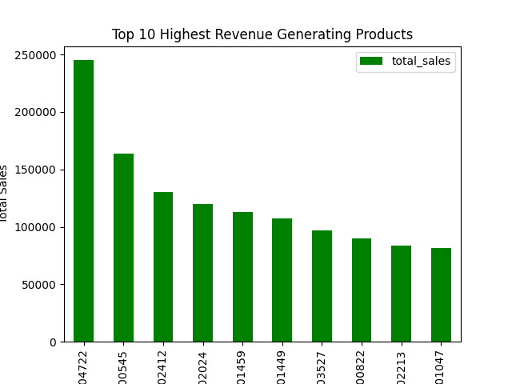
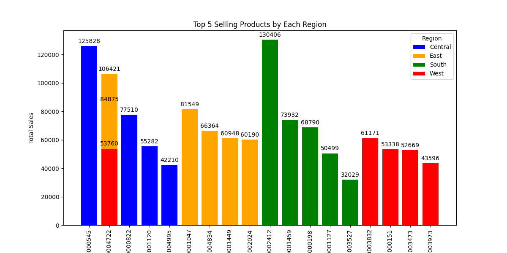
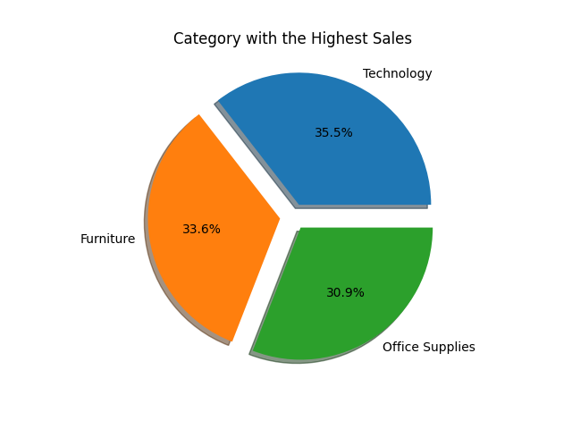
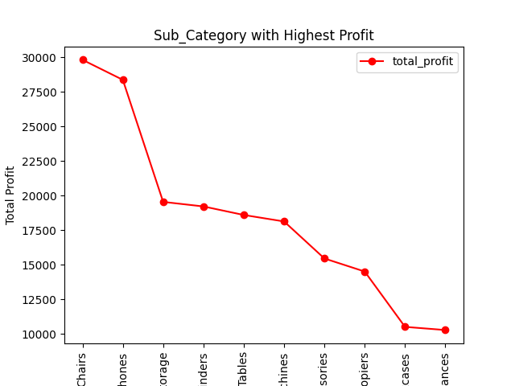
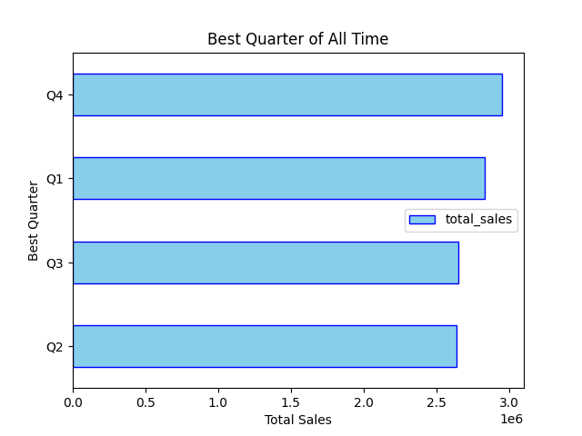
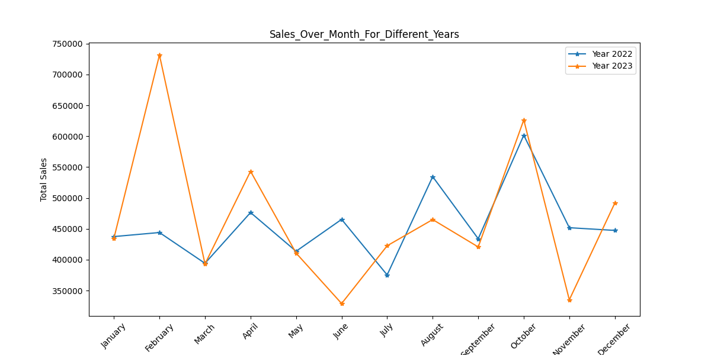
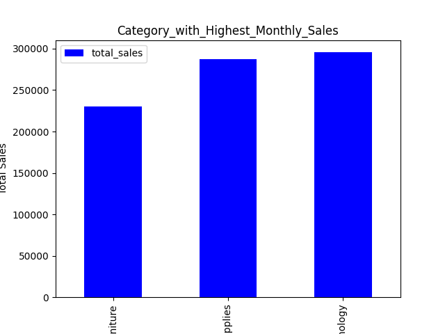

# 🛒 Retail Orders Sales Analysis | Python & SQL & Data Visualizations

## 📌 Project Overview

This project demonstrates an end-to-end retail sales analytics workflow
using **Python, SQL Server, Pandas, Matplotlib, and Seaborn**. Data was
collected from Kaggle, cleaned and transformed using Python, loaded into
SQL Server for business analysis, and visualized through professional
charts to uncover actionable business insights.

---

## 💼 Business Problem

Retail businesses generate large volumes of sales data, making it
difficult to identify: - Top-performing products and categories -
Regional sales performance - Profit-driving sub-categories - Monthly and
quarterly trends - Year-over-year growth opportunities

This project converts raw retail order data into meaningful business
insights.

---

## 📑 Table of Contents

- [Project Overview](#-project-overview)
- [Business Problem](#-business-problem)
- [Overwiew](#-objectives)
- [Visualizations](#-visualizations)
- [Key Insights](#-key-insights)
- [Business Recommendations](#-business-recommendations)
- [Dataset Information](#-dataset-information)
- [Data Source]()
- [Tools & Technologies](#️-tools--technologies)
- [Data Cleaning & Transformation]()
- [Project Workflow](#-project-workflow)
- [Project Impact]()
- [Project Structure](#-project-structure)
- [How to Run](#️-how-to-run)
- [Author & Contact](#-author)

## 🎯 Objectives

-   Build an end-to-end data analytics pipeline.
-   Clean and transform retail order data.
-   Perform business analysis using SQL.
-   Create professional visualizations in Python.
-   Generate actionable business recommendations.

---

## 🛠️ Tools & Technologies

-   Python
-   Pandas
-   NumPy
-   Matplotlib
-   Seaborn
-   SQL Server
-   Kaggle API
-   Jupyter Notebook

---

## 🔄 Project Workflow

1.  Data Collection (Kaggle API)
2.  Data Cleaning with Pandas
3.  Feature Engineering
4.  Load Data into SQL Server
5.  SQL Business Analysis
6.  Python Data Visualization
7.  Business Insights & Recommendations

---

## 📊 Visualizations

### 1. Top 10 Highest Revenue Generating Products



### 2. Top 5 Selling Products by Region



### 3. Category with Highest Sales



### 4. Highest Profit Sub-Categories



### 5. Best Quarter of All Time



### 6. Monthly Sales Comparison (2022 vs 2023)



### 7. Category-wise Monthly Sales



### 8. Sub-Category Profit Growth (2022 vs 2023)

.jpg)

---

## 💡 Key Insights

-   Technology generated the highest overall sales.
-   Chairs and Phones were among the most profitable sub-categories.
-   Q4 recorded the highest sales performance.
-   Regional demand varied significantly across products.
-   Several sub-categories showed strong year-over-year profit growth.

---

## 🚀 Business Recommendations

-   Increase inventory for high-revenue products.
-   Focus marketing on top-performing categories.
-   Expand successful regional product strategies.
-   Improve low-profit product segments.
-   Use seasonal trends to optimize inventory planning.

---

## 📂 Dataset Information

This project uses the **Retail Orders Dataset** obtained from **Kaggle**, containing transactional sales records from a retail business. The dataset was cleaned, transformed, and enriched using **Python (Pandas)** before being loaded into **SQL Server** for business analysis.

### Dataset Includes

| Category | Attributes |
|----------|------------|
| Order Details | Order ID, Order Date, Ship Date, Ship Mode |
| Customer Details | Customer ID, Customer Name, Segment |
| Location Details | Country, State, City, Postal Code, Region |
| Product Details | Product ID, Product Name, Category, Sub-Category |
| Sales Metrics | Sales, Quantity, Discount, Profit |

### Dataset Usage

The dataset was used to analyze:

- 📈 Revenue and Sales Performance
- 💹 Profitability Analysis
- 🌍 Regional Sales Trends
- 🛒 Product Performance
- 📦 Category & Sub-Category Analysis
- 📅 Monthly & Quarterly Sales Trends
- 📊 Year-over-Year Profit Growth

---

## 📂 Data Source

Dataset obtained from Kaggle and further cleaned, transformed, and modeled for analysis purposes.

- [retail-orders-dataset](retail-orders/retail-orders-dataset/orders.csv)

---

## 📂 Project Structure

```bash
Retail_Orders_Sales_Analysis/
│
├── retail-orders
│    ├── Charts/
│    └── retail-orders-dataset
├── README_Retail_Orders_Sales_Analysis.md
├── retail_order_Dashboard.ipynb
├── retail_orders_Sql.sql
└── retail_orders.zip
```

---

## ▶️ How to Run

1.  Download the dataset.
2.  Install required Python libraries.
3.  Execute the Jupyter Notebook.
4.  Run the SQL script.
5.  Review the generated charts.

---

## 👨‍💻 Author & Contact

**Dhammdeep Gajbhiye**

-   GitHub: https://github.com/dhammdeepgajbhiye32
-   LinkedIn: https://linkedin.com/in/dhammdeep-gajbhiye-57b38b16a/
-   Email: dhammdeepgajbhiye32@gmail.com

⭐ If you found this project useful, consider giving it a Star on
GitHub.
